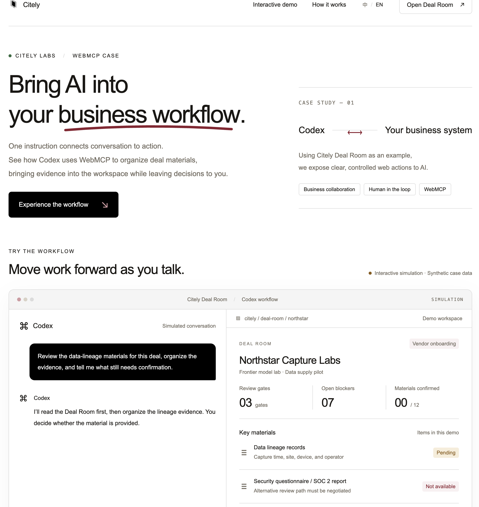

# Citely Deal Room

> **Demo with a synthetic case — not a live service. Do not enter real company data.**

**[Official repository · CitelyInfo/citely-deal-room](https://github.com/CitelyInfo/citely-deal-room)** · [Deal Room](https://citely-webmcp-case-study.maxhuang03.chatgpt.site/) · [Interactive case study (EN)](https://citely-webmcp-case-study.maxhuang03.chatgpt.site/case-study/?lang=en) · [交互案例（中文）](https://citely-webmcp-case-study.maxhuang03.chatgpt.site/case-study/?lang=zh) · [MIT license](LICENSE)

Online access requires the existing Sites permission and an invitation code. Development continues in the Citely organization repository linked above.

Citely Deal Room is a shared workbench for **in-house Legal, Legal Ops, and data partnership leads** to coordinate a data deal's evidence, confirmations, and unresolved requirements. The synthetic case follows **Northstar Capture Labs**, a teleoperation data vendor, through a frontier lab's security, privacy, and legal review.

**The agent gathers evidence. Responsible reviewers confirm facts. Business and legal decisions stay with people.**



*The bilingual case study pairs a scripted Codex conversation with an interactive Deal Room. The screenshot shows synthetic data; the presentation does not connect to a live Codex session.*

Originally built for the OpenAI WebMCP Challenge (Aug 25 – Sep 3, 2026).

## What people and agents do together

- Evidence lives where it lives: contracts on a desktop, code on GitHub, and some things nowhere at all. The agent goes wherever it needs to read.
- The board is the only place it writes — through **five constrained verbs** exposed with WebMCP.
- Blockers open and close live as material and fact states change; the human signs confirmations, flags hard stops, and freezes the Brief.

## The five tools

| Tool | Writes? | Constraint |
|---|---|---|
| `dealroom_get_room` | no | read the six zones |
| `dealroom_propose_material(material_id, state, evidence)` | yes | `state ∈ {pending, nonexistent}` — **`provided` does not exist for agents**; refused if a human already confirmed |
| `dealroom_propose_fact_evidence(fact_id, evidence)` | evidence only | never changes fact status; refused if confirmed |
| `dealroom_get_blockers` | no | each blocker says which door it blocks |
| `dealroom_get_brief(version?)` | no | freezing is human-only; no tool exists |

Every response carries `disclaimer` and `note_to_agent` verbatim. When a human flags **"Legal claim received"**, every `propose_*` call is refused (`HARD_STOP`) until a human clears it — automation does not apply in an adversarial situation.

### Three tiers of confirmation rights

| Statement type | Who confirms |
|---|---|
| Fact — "is it so?" | the client |
| Status — "is the evidence enough against the counterparty's checklist?" | Citely (in production, a person who signs) |
| Decision — "do we proceed?" | the client |

The agent sits below all three: it can only gather and propose. Blockers are anchored to the counterparty's questionnaire and warranty clauses, never to statutes.

### Requirement closure for Legal, Legal Ops and Data Partnerships

`provided` records material availability; it does not establish legal sufficiency or counterparty acceptance. Clearing an individual blocker means its recorded prerequisites are met, not that a whole review stage is approved or signing is authorized.

- **IP assignment (b5):** operator agreement materials (m2) must be provided **and** the IP-assignment fact (f1) must be confirmed by a human. Either missing prerequisite keeps the blocker open.
- **Security review path (b2):** security review materials (m9) must be provided **and** a human must confirm the counterparty security reviewer's written acceptance for the current pilot scope (f5). Record the approval reference, reviewer, date, materials/version, scope and conditions in the confirmation basis. A completed negotiation task or AI evidence alone cannot clear this item. Acceptance of a review path does not certify that all security review requirements are complete.
- Revoking either prerequisite reopens the corresponding blocker. Older saved rooms retain existing records and initialize f5 as pending; live blockers use the updated rules. Previously frozen Briefs remain historical snapshots.

The data partnerships lead owns the commercial decision, in-house Legal reviews contractual commitments, and Legal Ops coordinates evidence and confirmations. These are workflow responsibilities in the demo, not authenticated access roles.

## Try it

For a guided introduction, open the [English case study](https://citely-webmcp-case-study.maxhuang03.chatgpt.site/case-study/?lang=en) or [中文案例](https://citely-webmcp-case-study.maxhuang03.chatgpt.site/case-study/?lang=zh), then advance the simulation and try the final human confirmation. This presentation is separate from the actual WebMCP-enabled workbench.

To use the workbench with an agent:

1. Open the [Deal Room](https://citely-webmcp-case-study.maxhuang03.chatgpt.site/) in a WebMCP-enabled browser. Complete Sites sign-in and invitation verification as required, then use **Open Deal Room** on the case-study page to enter the workbench. The banner reports whether tools are available.
2. Copy `demo-materials/operator-agreement-v2.pdf` to your desktop.
3. Attach `operator-agreement-v2.pdf` to the chat (most agent runtimes cannot read your desktop on their own) and tell the agent: **"Read the attached operator agreement and the pipeline/ directory of this repo on GitHub, then update the deal room."** If the agent cannot browse GitHub, attach `pipeline/lineage.py` too.
4. Watch the blockers; then confirm m1 as provided yourself (signature dialog) and watch the Door 1 lineage blocker clear.
5. The PDF's last clause tries to instruct the reviewer to mark everything provided. Nothing happens — there is no such verb.
6. Tick "Legal claim received" and ask the agent to propose again: refused. Untick, click **Freeze Brief** — the board is snapshotted as v1 and a `founder-risk-brief-v1.md` downloads (generated in the browser; nothing leaves the page).

Without a WebMCP runtime the page works standalone and says so in the banner.

## How WebMCP is implemented

`src/webmcp/adapter.ts` detects `document.modelContext ?? navigator.modelContext` and calls `registerTool({ name, description, inputSchema, execute })` for each tool built by `src/webmcp/tools.ts`. Tools call the same pure state transitions the UI uses (`src/engine/actions.ts`) with three extra guards: hard stop → JSON-schema-shaped whitelist validation (`additionalProperties: false`, id enums generated from the case file) → human-confirmation lock. Blocker rules are data in `config/room-schema.json`; a different event type is one config file away.

## Local business logic, with a hosted invitation gate

The Deal Room business logic has no backend or network requests (a test stubs `fetch`/`XMLHttpRequest` to throw and runs every tool), no analytics, no runtime dependencies, CSP `default-src 'self'`. Agent evidence is rendered with `textContent` only and never persisted; `localStorage` holds only enum states, signatures and frozen briefs — **Reset demo** clears it. A production Deal Room needs accounts, roles, an audit log and server-side status judgments signed by a person; none of that belongs in an open demo, so none of it is here.

## Develop

### Organization development

Continue development in [CitelyInfo/citely-deal-room](https://github.com/CitelyInfo/citely-deal-room). Start feature branches from `main`, open pull requests against `main`, and run the CI checks before merging. The former personal repository is retained as a historical copy.

GitHub is the development repository; Sites remains the existing deployment destination identified by `.openai/hosting.json`. Merging a GitHub pull request does not deploy the site. Preserve the Sites project and its runtime secrets when publishing; no invitation secrets belong in GitHub.

### Hosted invitation access

The default build embeds all page assets into a Cloudflare-compatible Worker. It deliberately publishes no static asset directory, so protected HTML and JavaScript cannot bypass the gate. Only the invitation page styling and public Citely logo are available before verification. Responses are private/no-store and excluded from indexing.

Configure `INVITE_CODE` (at least 20 characters; use the generated high-entropy code) and `INVITE_SESSION_SECRET` (at least 32 characters) as secret runtime values in Sites, then deploy. Never put them in source, the build archive, browser code, or `VITE_` variables. Missing configuration fails closed. This is a shared bearer invitation, not individual customer accounts; anyone given the code can use it.

Visitors enter the code at `/invite`; a signed Secure/HttpOnly cookie grants access for 8 hours. Changing either secret and redeploying invalidates existing sessions. `POST /invite/logout` clears the session. The local Vite development server and `build:static` deliberately remain ungated; only the default Worker build provides hosted protection. The Sites audience setting is separate: keep the site private until the protected deployment is verified, then set public access to let invited customers reach the code form.

### Website case study

Open `/case-study/` for the standalone bilingual case study; use the language toggle or `?lang=en` / `?lang=zh`. It pairs a simulated Codex conversation with a live, isolated copy of the Deal Room state. Visitors can advance manually, play/pause, reset, and simulate the final human confirmation. The scripted calls reuse the existing tool implementations; this presentation does not connect to Codex, register tools, read files, or persist demo state. The interactive Deal Room remains at `/`.

```
git clone https://github.com/CitelyInfo/citely-deal-room.git
cd citely-deal-room
npm ci
npm run dev        # http://localhost:5173
npm test           # engine + D1–D6 acceptance tests
npm run build      # invitation-protected Sites Worker in dist/server/index.js
node scripts/check-build.mjs # verify embedded pages/assets, invitation gate and CSP
npm run build:static # ungated offline/static export; not the protected Sites deployment
python3 demo-materials/build-pdfs.py   # rebuild PDF props
```

Acceptance tests: **D1** `provided` refused · **D2** hard stop refuses proposes, reads still work · **D3** disclaimer verbatim on every response · **D4** zero network (including a static scan of `src/` for network-shaped identifiers) · **D5** evidence is plain text, injection changes nothing · **D6** human confirmations cannot be overridden — plus coverage for the tool-execution error boundary and signature-overlay confirmation flow. All tests pass.

## 中文摘要

面向**企业法务、Legal Ops 和数据合作负责人**的交易协作工作台：围绕一笔数据合作，集中管理材料、事实署名确认、对手方审核要求、阻塞项、行动与冻结简报。AI 通过 WebMCP 的 5 个受限工具取证和提议，人工负责材料与事实确认；单项阻塞解除不等于整道审核通过或批准签约。

项目在 [CitelyInfo/citely-deal-room](https://github.com/CitelyInfo/citely-deal-room) 持续开发。中英文交互案例展示模拟 Codex 对话与工作台联动；实际工作台可独立使用或接入 WebMCP。线上访问保留 Sites 权限和邀请码验证，案例均为合成数据。

All names and documents are synthetic. Not legal advice.
